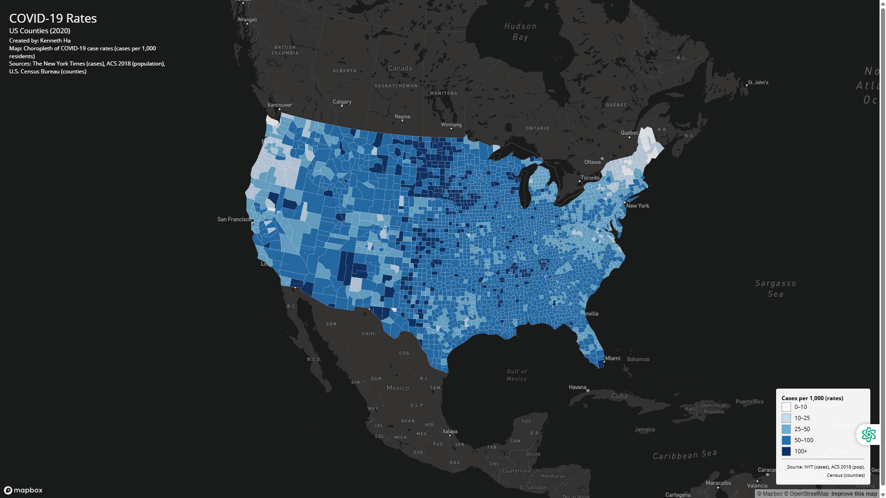
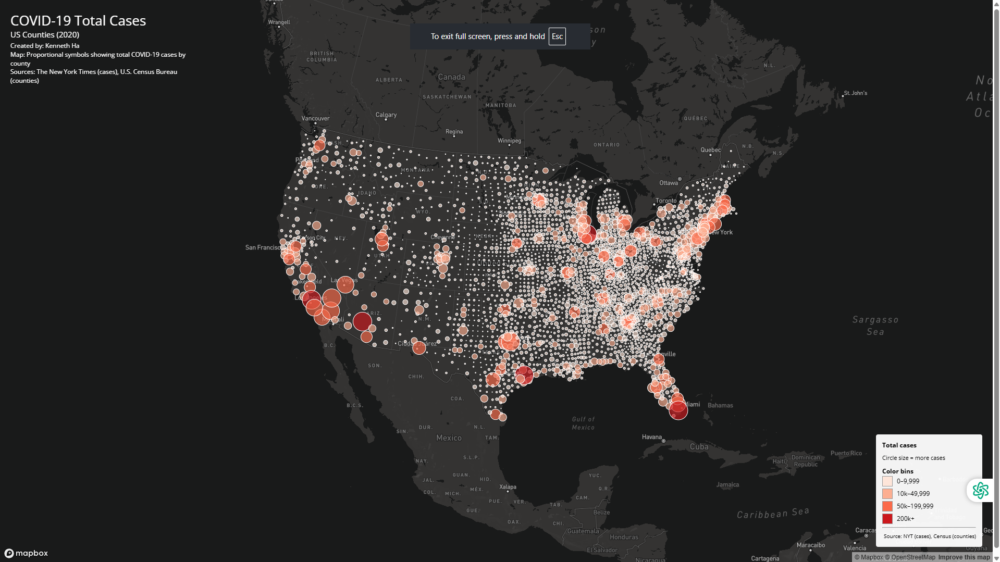

# COVID-19 Thematic Web Maps (United States, 2020)

## Project Description
This project consists of two interactive web maps that visualize COVID-19 impacts across U.S. counties during 2020. The goal of the project is to compare spatial patterns of COVID-19 case *rates* and *total case counts* using different thematic mapping techniques. A choropleth map is used to display COVID-19 case rates (cases per 1,000 residents), while a proportional symbol map is used to represent total confirmed COVID-19 cases by county. These complementary maps demonstrate how different cartographic techniques can reveal different aspects of the same dataset.

## Interactive Maps
- **COVID-19 Case Rates (Choropleth Map):**  
  [[Open map1.html](map1.html)](https://kha50.github.io/us-covid-web-maps/map1.html)

- **COVID-19 Total Cases (Proportional Symbols Map):**  
  [[Open map2.html](map2.html)](https://kha50.github.io/us-covid-web-maps/map2.html)

## Screenshots
*(Screenshots of each map are provided below.)*

## Primary Functions
Both maps were built using Mapbox GL JS and include several interactive and cartographic functions:

- **Choropleth mapping** of COVID-19 case rates using a sequential color scheme
- **Proportional symbol scaling** based on total COVID-19 case counts
- **Interactive popups** that display county-level information when a user clicks on a map feature
- **Custom legends** explaining symbol sizes and color classifications
- **On-the-fly Albers Equal Area projection**, which was not covered extensively in lectures but is implemented using Mapbox GL JS’s projection settings
- Responsive map layout that adjusts to different screen sizes

## Libraries in Use
- **Mapbox GL JS** – interactive web map rendering and user interaction
- **Mapshaper** – preprocessing, simplification, and conversion of spatial data

## Data Sources
- COVID-19 case data: *The New York Times COVID-19 Dataset*
- Population data: *2018 American Community Survey (ACS) 5-Year Estimates*
- County boundary data: *U.S. Census Bureau*

## Credits and Acknowledgments
The COVID-19 datasets used in this project were processed and prepared by **Steven Bao** for use in GEOG 458. This project was completed as part of **Lab 3** for the course.

## Additional Information
All spatial data were converted from shapefile format to GeoJSON using Mapshaper. Geometry was simplified to improve web performance, and unused attributes were removed prior to visualization. Although the GeoJSON data are stored in WGS84 coordinates as required by Mapbox GL JS, both maps are displayed using the **Albers Equal Area projection**, which is well suited for national-scale mapping of the United States.
